# 🚗 DriveNow - Vehicle Rental Management System

DriveNow is a full-stack vehicle rental management system that allows customers to browse, book, and manage vehicle rentals online. The platform features a responsive web interface and a robust backend API with MySQL database integration.

## 🎯 Overview

DriveNow is a comprehensive vehicle rental platform that connects customers with a diverse fleet of vehicles. The system provides:

- **For Customers:** Browse vehicles, make bookings, manage reservations, track booking history
- **For Admins:** Manage vehicle inventory, track bookings, generate reports, handle maintenance
- **For Developers:** RESTful API, well-documented codebase, easy to extend

### Project Highlights

✨ **24 Different Vehicles** - Sedans, SUVs, Hatchbacks, Electric vehicles, MPVs, Two-wheelers
🏆 **Full-featured Booking System** - Date selection, location management, real-time cost calculation
💾 **Persistent Storage** - All data stored in MySQL with localStorage backup for bookings
🔐 **Authentication** - Email-based registration and login with password validation
📱 **Responsive Design** - Works seamlessly on desktop, tablet, and mobile devices
⚡ **Fast Performance** - Optimized queries, lazy loading, efficient caching

---

## ✨ Key Features

### 👤 Customer Features

- **User Registration & Login**
  - Email validation
  - Password confirmation
  - Phone number verification
  - Secure authentication tokens

- **Vehicle Browsing**
  - Search by brand, type, price range
  - Filter available vehicles only
  - View detailed specifications
  - See pricing and availability

- **Booking Management**
  - Select dates and pickup location
  - Real-time cost calculation
  - Add special notes/requests
  - View booking history
  - Cancel bookings with confirmation

- **Booking Persistence**
  - Bookings saved to localStorage
  - Sync with MySQL database
  - Access bookings offline
  - Booking status tracking

### 👨‍💼 Admin Features

- **Admin Dashboard**
  - View system statistics
  - Monitor active bookings
  - Track revenue metrics

- **Vehicle Management**
  - Add/edit/delete vehicles
  - Update availability status
  - Track maintenance records
  - Manage pricing

- **Customer Management**
  - View all customers
  - Track booking history
  - Generate customer reports

### 🔧 Technical Features

- **RESTful API**
  - Clean endpoint design
  - Proper HTTP status codes
  - CORS enabled for cross-origin requests
  - JSON response format

- **Database**
  - 7 normalized tables
  - Foreign key relationships
  - Indexes for performance
  - Sample data included

- **Security**
  - Password hashing with BCrypt
  - JWT token authentication
  - SQL injection prevention with prepared statements
  - Input validation and sanitization

---

## 💻 Tech Stack

### Frontend

- **HTML5** - Semantic markup
- **CSS3** - Bootstrap 5, Custom styling
- **JavaScript** - Vanilla JS, ES6+
- **Bootstrap 5** - Responsive framework
- **Icons** - Bootstrap Icons

### Backend

- **Java 11** - Programming language
- **Apache Tomcat 9.0+** - Web server
- **Servlets** - HTTP request handling
- **JDBC** - Database connectivity

### Database

- **MySQL 8.0+** - Relational database
- **7 Tables** - Normalized schema
- **Indexes** - Query optimization

### Build & Deployment

- **Maven** - Dependency management
- **Git** - Version control

### Libraries & Dependencies

```xml
- MySQL JDBC Driver 8.0.33
- Google Gson 2.10.1
- JWT (jjwt) 0.11.5
- BCrypt 0.4
- SLF4J & Logback - Logging
- JUnit 4.13 - Testing
```

---

## 📸 Screenshots

### 🏠 Customer Interface

#### Landing Page

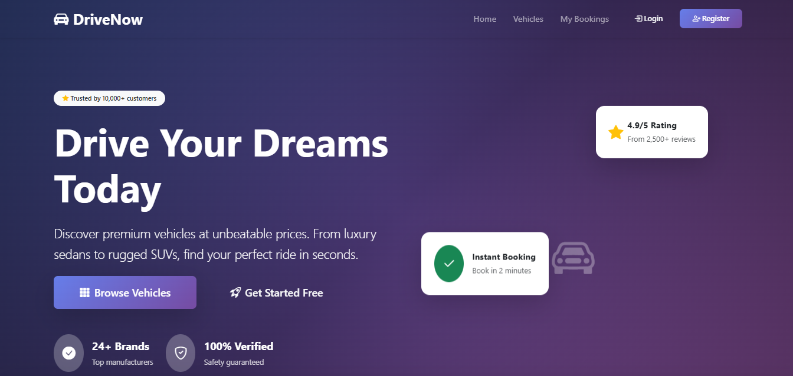

#### Vehicle Browsing

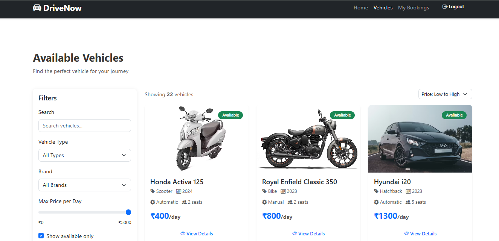

#### Vehicle Details

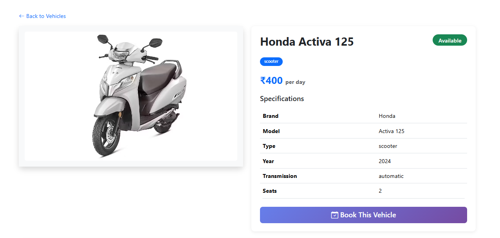

#### Booking System

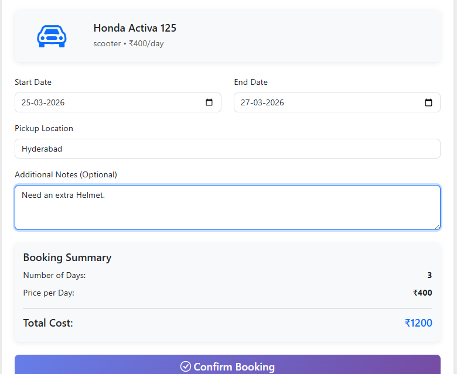

#### Booking History

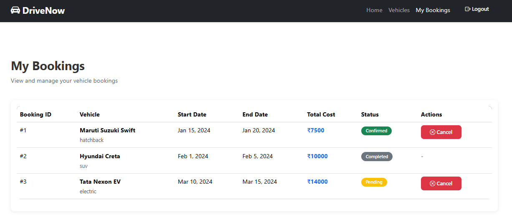

---

### 🔐 Authentication

#### Customer Login

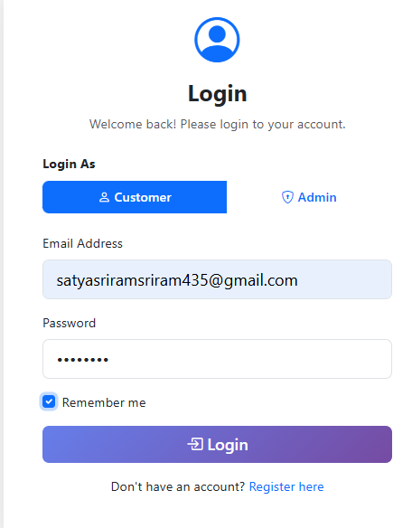

#### Customer Registration

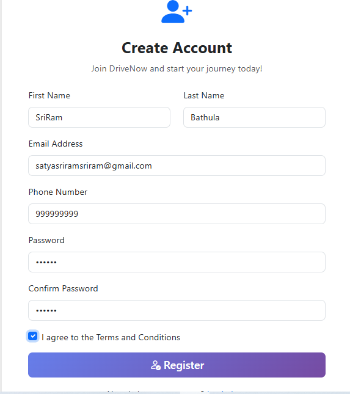

---

### 👨‍💼 Admin Interface

#### Admin Login

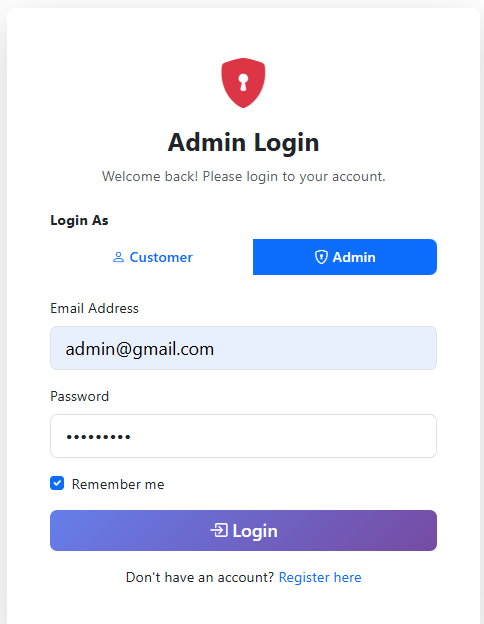

#### Admin Dashboard

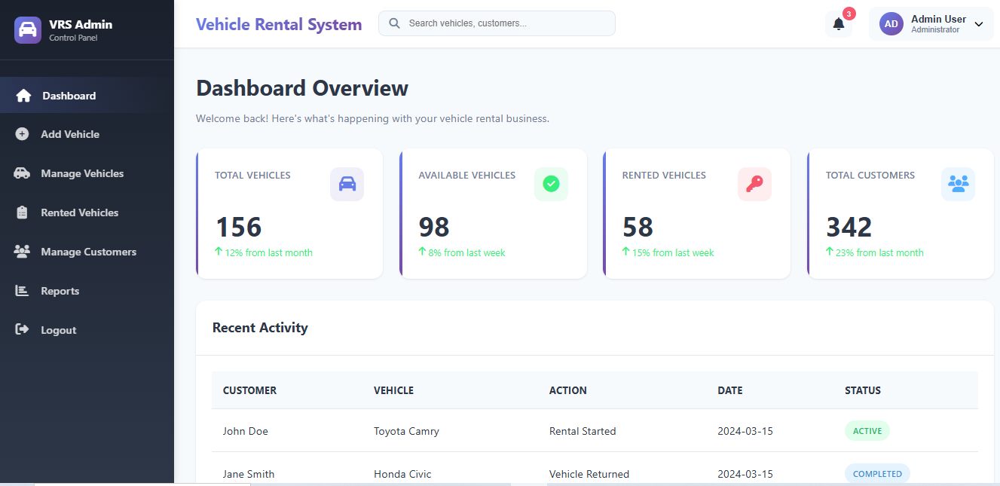

#### Add New Vehicle

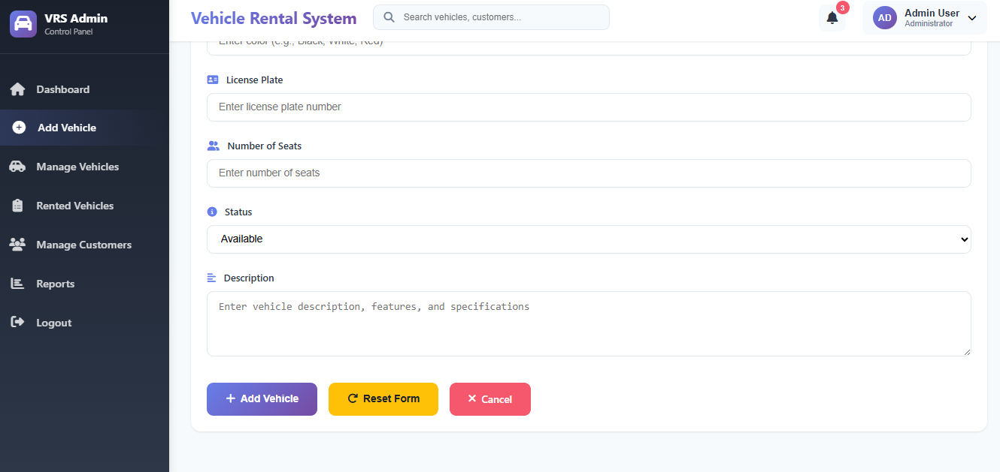

#### Manage Vehicles

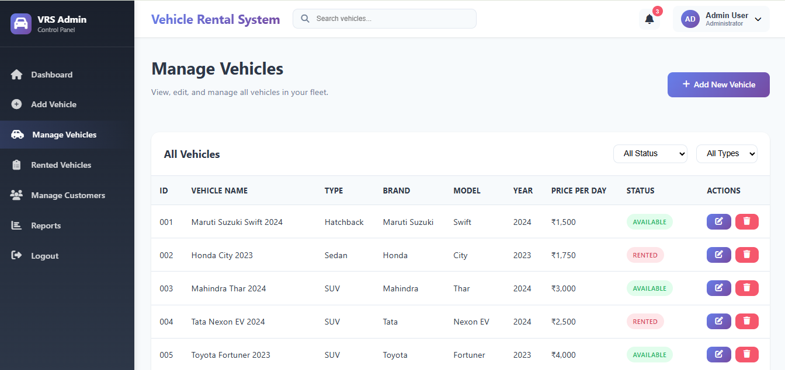

---

## 📋 Prerequisites

Before you begin, ensure you have the following installed:

| Requirement              | Version | Download                                                               |
| ------------------------ | ------- | ---------------------------------------------------------------------- |
| **Java Development Kit** | 11+     | [oracle.com/java](https://www.oracle.com/java/technologies/downloads/) |
| **MySQL Server**         | 8.0+    | [mysql.com](https://www.mysql.com/downloads/)                          |
| **Apache Tomcat**        | 9.0+    | [tomcat.apache.org](https://tomcat.apache.org/)                        |
| **Maven**                | 3.6+    | [maven.apache.org](https://maven.apache.org/download.cgi)              |
| **Git**                  | Latest  | [git-scm.com](https://git-scm.com/)                                    |
| **Web Browser**          | Modern  | Chrome, Firefox, Safari, Edge                                          |


## 📁 Project Structure

```
drivenow/
│
├── 📂 frontend/                      # Web UI (HTML/CSS/JavaScript)
│   ├── index.html                   # Landing page
│   ├── vehicles.html                # Browse vehicles
│   ├── booking.html                 # Make booking
│   ├── booking-history.html         # View bookings
│   ├── customer-login.html          # Customer login
│   ├── customer-register.html       # Customer registration
│   ├── admin-login.html             # Admin login
│   ├── admin/                       # Admin panel pages
│   │   ├── dashboard.html
│   │   ├── manageVehicles.html
│   │   └── rentedVehicles.html
│   ├── css/
│   │   └── styles.css              # Main stylesheet
│   └── js/
│       ├── api.js                  # API client
│       ├── main.js                 # Utility functions
│       ├── customer.js             # Customer logic
│       ├── admin.js                # Admin logic
│       └── navbar-auth.js          # Navigation
│
├── 📂 backend/                       # Java Servlet Backend
│   ├── src/com/drivenow/
│   │   ├── servlet/                # REST API endpoints
│   │   │   ├── VehicleServlet.java
│   │   │   ├── BookingServlet.java
│   │   │   ├── AuthServlet.java
│   │   │   └── AdminServlet.java
│   │   ├── dao/                    # Data Access Objects
│   │   │   ├── VehicleDAO.java
│   │   │   ├── BookingDAO.java
│   │   │   ├── CustomerDAO.java
│   │   │   └── AdminDAO.java
│   │   ├── model/                  # Entity classes
│   │   │   ├── Vehicle.java
│   │   │   ├── Booking.java
│   │   │   ├── Customer.java
│   │   │   └── Admin.java
│   │   ├── util/                   # Utilities
│   │   │   └── DBUtil.java         # Database connection
│   │   └── filter/
│   │       └── CORSFilter.java     # CORS support
│   ├── pom.xml                     # Maven configuration
│   ├── SETUP_GUIDE.md              # Detailed setup
│   └── WebContent/WEB-INF/web.xml  # Servlet config
│
├── 📂 database/                      # Database scripts
│   ├── drivenow_database.sql       # Schema & tables
│   ├── insert_vehicles.sql         # 24 vehicles
│   └── useful_queries.sql          # Common queries
│
├── 📄 README.md                      # This file
├── 📄 README_DATABASE_BACKEND.md    # Database guide
├── 📄 IMPLEMENTATION_CHECKLIST.md   # Setup checklist
└── 📄 LICENSE                        # MIT License
```


## 📖 Usage Guide

### For Customers

#### 1. **Register**

- Navigate to Registration page
- Enter name, email, phone, password
- Click Register
- Redirect to login page

#### 2. **Login**

- Enter email and password
- Click Login
- Redirected to vehicles page

#### 3. **Browse Vehicles**

- View all available vehicles
- Filter by type, brand, price
- Sort by price or brand
- Click "View Details" for specifications

#### 4. **Make a Booking**

- Click "Book Now" on a vehicle
- Select start and end dates
- Enter pickup location
- Add special notes (optional)
- System calculates total cost
- Click "Confirm Booking"
- Booking saved and redirected to history

#### 5. **Manage Bookings**

- Click "My Bookings"
- View all your bookings
- See booking status (pending, confirmed, completed)
- Cancel confirmed bookings
- Check booking cost and dates

#### 6. **Logout**

- Click "Logout" in navigation
- Session cleared, redirected to home

### For Admins

#### 1. **Admin Login**

- Navigate to Admin Login
- Enter credentials
- Access admin dashboard

#### 2. **Dashboard**

- View key metrics
- See total vehicles, bookings, revenue
- Monitor active rentals

#### 3. **Manage Vehicles**

- Add new vehicles
- Edit existing vehicles
- Update availability
- Track maintenance

#### 4. **View Bookings**

- Check all customer bookings
- Update booking status
- Generate reports

---

## 🗄️ Database Schema

### Tables Overview

| Table                   | Purpose             | Records     |
| ----------------------- | ------------------- | ----------- |
| **admin**               | Admin accounts      | 1 sample    |
| **customers**           | Customer profiles   | 5 samples   |
| **vehicles**            | Vehicle inventory   | 24 vehicles |
| **bookings**            | Booking records     | Dynamic     |
| **payments**            | Payment tracking    | Dynamic     |
| **reviews**             | Customer reviews    | Dynamic     |
| **maintenance_records** | Maintenance history | Dynamic     |

### Key Tables

#### Vehicles Table

```sql
vehicle_id (INT, Primary Key)
brand VARCHAR(50)              -- Maruti Suzuki, Hyundai, etc.
model VARCHAR(50)              -- Swift, Creta, City, etc.
type VARCHAR(30)               -- sedan, suv, hatchback, etc.
year INT                       -- 2023, 2024
transmission VARCHAR(20)       -- manual, automatic
seats INT                      -- 2, 4, 5, 7
price_per_day DECIMAL(10,2)   -- ₹400 to ₹4,500
description TEXT               -- Vehicle description
image_url VARCHAR(500)         -- Image link
is_available BOOLEAN           -- TRUE or FALSE
fuel_type VARCHAR(20)          -- Petrol, Diesel, Electric
maintenance_status VARCHAR(30) -- good, fair, maintenance
created_at TIMESTAMP
updated_at TIMESTAMP
```

#### Bookings Table

```sql
booking_id (INT, Primary Key)
customer_id INT (Foreign Key)  -- Links to customers
vehicle_id INT (Foreign Key)   -- Links to vehicles
start_date DATE
end_date DATE
pickup_location VARCHAR(255)
dropoff_location VARCHAR(255)
notes TEXT
total_cost DECIMAL(10,2)
status VARCHAR(20)             -- pending, confirmed, completed, cancelled
created_at TIMESTAMP
updated_at TIMESTAMP
```

#### Customers Table

```sql
customer_id (INT, Primary Key)
email VARCHAR(100)             -- UNIQUE
password VARCHAR(255)          -- Hashed with BCrypt
first_name VARCHAR(50)
last_name VARCHAR(50)
phone VARCHAR(20)
license_number VARCHAR(50)     -- Optional, UNIQUE
address VARCHAR(255)
city VARCHAR(50)
state VARCHAR(50)
postal_code VARCHAR(10)
country VARCHAR(50)
is_active BOOLEAN
created_at TIMESTAMP
updated_at TIMESTAMP
```

### Relationships

```
Customers (1) ──────────(M) Bookings
  |                       |
  │                       └──────(M) Vehicles
  ├──────────────────(M) Payments
  ├──────────────────(M) Reviews
  └──────────────────(M) Maintenance Records

Vehicles (1)  ──────────(M) Bookings
  |                       |
  │                       ├──────(1) Payments
  │                       └──────(1) Reviews
  └──────────────────(M) Maintenance Records
```

---

## 🚗 Available Vehicles

Total: **24 Vehicles** in 7 categories

### Sedans (₹1,400 - ₹1,800/day)

| Brand         | Model  | Transmission | Seats | Price  | Available |
| ------------- | ------ | ------------ | ----- | ------ | --------- |
| Maruti Suzuki | Dzire  | Manual       | 5     | ₹1,400 | ✅        |
| Honda         | City   | Automatic    | 5     | ₹1,800 | ✅        |
| Hyundai       | Verna  | Automatic    | 5     | ₹1,600 | ✅        |
| Honda         | Amaze  | Automatic    | 5     | ₹1,500 | ✅        |
| Volkswagen    | Virtus | Automatic    | 5     | ₹1,700 | ✅        |

### SUVs (₹2,000 - ₹4,500/day)

| Brand         | Model     | Transmission | Seats | Price  | Available |
| ------------- | --------- | ------------ | ----- | ------ | --------- |
| Hyundai       | Creta     | Automatic    | 5     | ₹2,500 | ✅        |
| Tata          | Nexon     | Automatic    | 5     | ₹2,000 | ❌        |
| Kia           | Seltos    | Automatic    | 5     | ₹2,400 | ✅        |
| Toyota        | Fortuner  | Automatic    | 7     | ₹4,500 | ✅        |
| Mahindra      | Thar      | Manual       | 4     | ₹3,500 | ❌        |
| Mahindra      | XUV700    | Automatic    | 7     | ₹3,200 | ✅        |
| MG            | Hector    | Automatic    | 5     | ₹2,800 | ✅        |
| Tata          | Harrier   | Automatic    | 5     | ₹2,900 | ✅        |
| Maruti Suzuki | Brezza    | Automatic    | 5     | ₹2,100 | ✅        |
| Mahindra      | Scorpio N | Manual       | 7     | ₹3,000 | ✅        |

### Hatchbacks (₹1,300 - ₹1,500/day)

| Brand         | Model | Transmission | Seats | Price  | Available |
| ------------- | ----- | ------------ | ----- | ------ | --------- |
| Maruti Suzuki | Swift | Manual       | 5     | ₹1,500 | ✅        |
| Hyundai       | i20   | Automatic    | 5     | ₹1,300 | ✅        |

### Electric Vehicles (₹2,800 - ₹3,500/day)

| Brand | Model    | Transmission | Seats | Price  | Available |
| ----- | -------- | ------------ | ----- | ------ | --------- |
| Tata  | Nexon EV | Automatic    | 5     | ₹2,800 | ✅        |
| MG    | ZS EV    | Automatic    | 5     | ₹3,500 | ✅        |

### MPVs/MUVs (₹1,900 - ₹3,000/day)

| Brand         | Model         | Transmission | Seats | Price  | Available |
| ------------- | ------------- | ------------ | ----- | ------ | --------- |
| Toyota        | Innova Crysta | Automatic    | 7     | ₹3,000 | ✅        |
| Maruti Suzuki | Ertiga        | Manual       | 7     | ₹1,900 | ✅        |
| Kia           | Carens        | Automatic    | 7     | ₹2,200 | ✅        |

### Two-Wheelers (₹400 - ₹800/day)

| Brand         | Model       | Transmission | Seats | Fuel   | Price | Available |
| ------------- | ----------- | ------------ | ----- | ------ | ----- | --------- |
| Honda         | Activa 125  | Automatic    | 2     | Petrol | ₹400  | ✅        |
| Royal Enfield | Classic 350 | Manual       | 2     | Petrol | ₹800  | ✅        |

